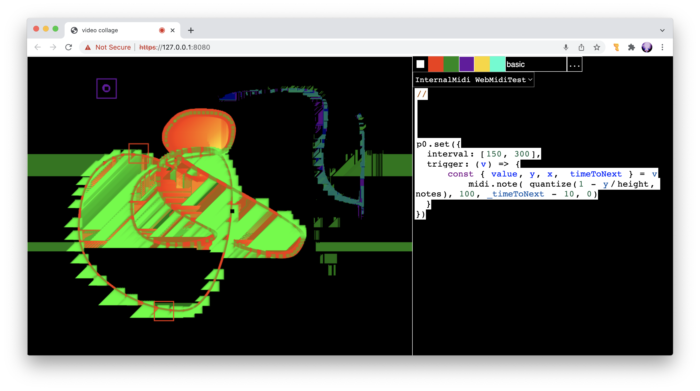

# [WIP] fubbles /// function scribbles
freehand drawing editorand livecodable sequencer



The basic structure of this app is a drawing editor and a code editor within the same interface. Drawing with the mouse in the square on the left creates a set of x and y values in time. These values are looped in time, creating a repeating pattern.

Various parameters of a drawing can be used as functions or lfos within a live-coded program. It can also be used to trigger discrete events such as a note on or note off event. Hydra is bundled within this app, but you can also use WebMidi to use fubbles as a control surface for another program, or load other javascript libraries to control sound directly.

### Basic Usage
Note: this project is in its vary early stages and most or all of the syntax will most likely change. 

To draw in the editor, select a color in the top right of the screen, and then draw something in the square on the left hand side of the screen. Each drawing is refered to by the variable `f` followed by an index number, and is represented by a different color on the screen. For example, `f0` is used to reference the first drawing (in red). 

The following is a basic example using the x position of the red line to control the size of a square:

```javascript
shape(4, () => f0.x/width).out()
```

To run this code, copy and paste it into the editor on the right side of the screen. Press Ctrl + Enter to run the code. Click on the red square at the top to select the red drawing tool (which corresponds to f0), and then draw something inside the square on the left. 

Here is an example using the x position of the red line to control the size of the square, and the y position to control the hue:
```javascript
shape(4, () => f0.x/width)
  .color(1, -1)
  .hue(() => f0.y/height)
  .out()
```

You can also send midi out from the parameters of the drawing. The midi can be continuous control values or discrete notes. For example, the following code sends  a midi node events every 250 milliseconds, where the y position of the drawing corresponds to the pitch of the note. In this example, `trigger` and `interval` are specific properties that can be set on the object f0. `trigger` is a function, that should be called everytime an event should occur. 
`interval` is the interval (in milliseconds) at which an event should occur. 
`quantize` is a utility function that accepts a value, and an array of values that that value should be mapped to. 

```javascript
//
notes = [57, 59, 61, 64, 66, 69, 71, 73, 76, 78, 81, 83, 85, 88, 90]
//
//
f0.set({
  interval: 250,
  trigger: ({ y }) => {
     const i = quantize(1 - y/height, notes)
      midi.note( i, 100, 20, 0) // sends a midi note with parameters (note value, velocity, duration, midi channel)
  }
})
```

The `interval` parameter can also be a function. For example, the following function sets a random interval between each successive event:
```javascript
choose = (arr) => () => arr[Math.floor(Math.random()*arr.length)]
//
f0.set({
  interval: choose([150, 400]),
   trigger: ({ y }) => {
     const i = quantize(1 - y/height, notes)
      midi.note( i, 100, 20, 0) // sends a midi note with parameters (note value, velocity, duration, midi channel)
  }
})
```

### Cloning and running

You need local certs in order to run this using https. e.g.:
```
openssl req -x509 -out certs/server.cer -keyout certs/server.key \
  -newkey rsa:2048 -nodes -sha256 \
  -subj '/CN=localhost' -extensions EXT -config <( \
   printf "[dn]\nCN=localhost\n[req]\ndistinguished_name = dn\n[EXT]\nsubjectAltName=DNS:localhost\nkeyUsage=digitalSignature\nextendedKeyUsage=serverAuth")
```

